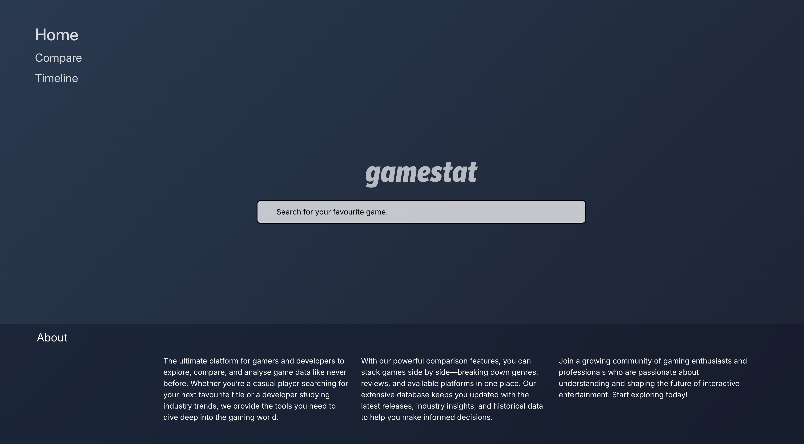
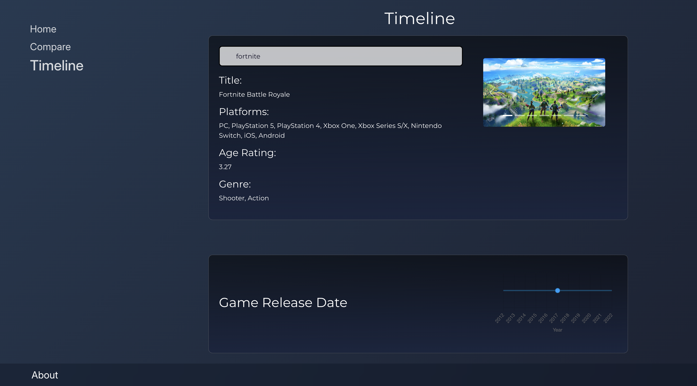

# Gamestat | Game Comparison

## Overview
Gamestat is a clean and user-friendly application that allows users to compare different games based on various factors such as price, ratings, platform availability, and features. Designed with a minimalist UI, the app provides a seamless experience for gamers looking to make informed decisions about their next purchase.

## Features
- Compare multiple games side by side
- View detailed game information (price, ratings, platform support, and more)
- Simple and intuitive user interface
- Fast and responsive design

## Tech Stack
- **Frontend:** HTML, CSS, JavaScript (React)
- **Backend:** Node.js 
- **API Integration:** Fetching game details from an external API (RAWG)

## Setup Instructions
### Prerequisites
- Node.js and npm/yarn installed

### Installation
1. Clone the repository:
   git clone https://github.com/wrapperik/formative-one-gamestat.git
2. Navigate to the project folder:
3. Install dependencies:
   npm install  
4. Start the development server:
   npm start

## Approach
The app was developed with a focus on simplicity, efficiency, and user experience. The UI is kept clean and intuitive, ensuring users can easily compare games without unnecessary clutter. Data is fetched dynamically from an external API to keep game details up to date. A modular and scalable architecture was used to make future enhancements seamless.

---
Enjoy using Gamestat!

## Screenshots

## Deploy to Heroku

Quick steps to deploy this app to Heroku from your machine:

1. Install the Heroku CLI: https://devcenter.heroku.com/articles/heroku-cli
2. Login to Heroku in your terminal:

   heroku login

3. Create a new Heroku app (or use an existing name):

   heroku create your-app-name

4. Push to Heroku (this repo's main branch):

   git push heroku main

Notes:
- This project uses a small Express server (`server.js`) and a `Procfile` so Heroku will run `node server.js` after build.
- We added an `engines` entry in `package.json` to request Node 18 on Heroku and a `heroku-postbuild` script to build the React app.
- If your app doesn't build on Heroku, try setting the buildpack or checking the Node/npm versions.

